# Alexaスキル開発ハンズオン ～S3を繋げてAPL対応スキルを作ろう!～

## プロジェクトを作成する
Duration: 1:00

新規スキルのプロジェクトを作成します。こちらにアクセスしてください。
[https://developer.amazon.com/ja/alexa-skills-kit](https://developer.amazon.com/ja/alexa-skills-kit)

### 1-1. スキル開発を始めよう！
［スキル開発を始める］をクリックします。


Amazonのアカウント情報を入力してログインします。


［スキルの作成］ボタンをクリックします。

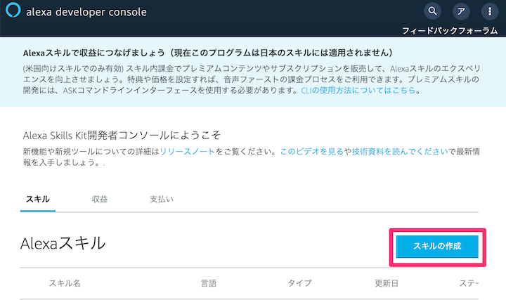

スキル名「メモスキル」を入力して、［カスタム］と［Alexaがホスト］をそれぞれ選択します。
最後に［スキルを作成］ボタンをクリックします。

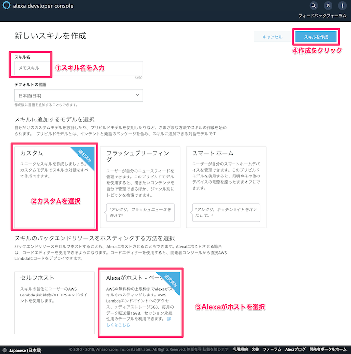

## スロットとインテントを作成しよう！
Duration: 6:00

### 2-1. スロットを作成する
メモをセーブとロードのスロットを作成します。左側メニューのスロットタイプにある［追加］ボタンをクリックします。

「MemoSlot」と入力して［カスタムスロットタイプを作成］ボタンをクリックします。


「メモをセーブ」や「メモをロード」という言葉に反応させたいので、セーブとロードをそれぞれ登録します。同義語にそれ以外の言葉も登録しておきます。


### 2-2. インテントを作成する
MainIntentを作成します。左側メニューのインテントにある［追加］ボタンをクリックします。

「MainIntent」と入力して［カスタムインテントを作成］ボタンをクリックします。

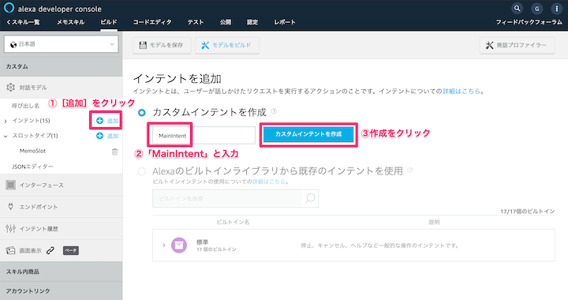

インテントスロットを追加します。`any`と入力して［＋］をクリックします。プルダウンメニューから`AMAZON.SearchQuery`を選択します。［ダイアログを編集］リンクをクリックします。


必須入力を有効化にします。Alexaの音声プロンプト部分に「メモする内容を言ってください。」と入力します。

ユーザー発話部分は`{any}`と入力します。ユーザーが発話したらanyに格納されます。


MainIntent部分をクリックして、元の画面に戻ります。


「オートデリゲートを無効化」をプルダウンメニューから選択します。


「stat」と入力して［＋］をクリックします。プルダウンメニューは先程作成した`MemoSlot`を選択します。


サンプル発話に考えられる文章を登録していきます。

これで「メモをセーブ」や「メモをロード」という言葉に反応できるようになりました。

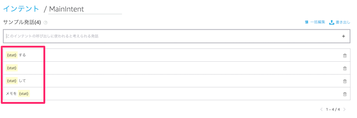

最後に必ず「保存」と「ビルド」を実行しておいてください。

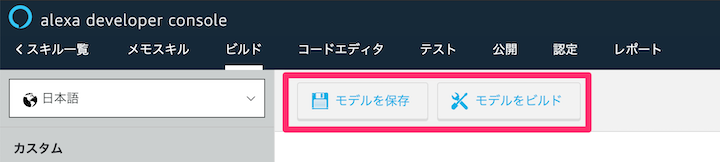

## Alexa-hostedでスキルを作ろう
Duration: 6:00

### 3-1. S3にアクセスするプログラムを追加する
コードエディタタブをクリックします。左側にあるファイルから`package.json`を開きます。

S3のnpm依存関係を追加します。

```
"ask-sdk-s3-persistence-adapter": "^2.0.0"
```


```package.json
{
  "name": "hello-world",
  "version": "0.9.0",
  "description": "alexa utility for quickly building skills",
  "main": "index.js",
  "scripts": {
    "test": "echo \"Error: no test specified\" && exit 1"
  },
  "author": "Amazon Alexa",
  "license": "ISC",
  "dependencies": {
    "ask-sdk-core": "^2.0.7",
    "ask-sdk-model": "^1.4.1",
    "aws-sdk": "^2.326.0",
    "ask-sdk-s3-persistence-adapter": "^2.0.0"  // ←これを追加
  }
}
```

### 3-2. index.jsファイルを編集する
プログラムの中身を編集します。`index.js`ファイルを開きます。


ファイルは下記からコピーしてください。
[https://raw.githubusercontent.com/gaomar/apl_handson_190323/master/files/step1.js](https://raw.githubusercontent.com/gaomar/apl_handson_190323/master/files/step1.js)

```javascript:index.js
const Alexa = require('ask-sdk-core');

// 1. ask persistence adapterの読み込み
const persistenceAdapter = require('ask-sdk-s3-persistence-adapter');

// 2. スキルビルダーをアダプターを使用して初期化
const skillBuilder = Alexa.SkillBuilders.custom().withPersistenceAdapter(
    new persistenceAdapter.S3PersistenceAdapter({bucketName:process.env.S3_PERSISTENCE_BUCKET})
);

// スキル起動時
const LaunchRequestHandler = {
    canHandle(handlerInput) {
        return handlerInput.requestEnvelope.request.type === 'LaunchRequest';
    },
    handle(handlerInput) {
        const speechText = 'メモを保存する場合は「メモをセーブ」。メモを聞く場合は「メモをロード」と言ってください。';
        return handlerInput.responseBuilder
            .speak(speechText)
            .reprompt(speechText)
            .getResponse();
    }
};

// メモを保存or読み取り判別
const MainIntentHandler = {
    canHandle(handlerInput) {
        return handlerInput.requestEnvelope.request.type === 'IntentRequest'
            && handlerInput.requestEnvelope.request.intent.name === 'MainIntent'
            && handlerInput.requestEnvelope.request.dialogState === 'STARTED';
    },
    async handle(handlerInput) {
        const intent = handlerInput.requestEnvelope.request.intent;
        const memoSlot = intent.slots.stat;
        var modeVal = '';
        
        if (memoSlot.value !== null) {
            if (memoSlot.resolutions["resolutionsPerAuthority"][0]["status"]["code"] === 'ER_SUCCESS_MATCH') {
                modeVal = memoSlot.resolutions["resolutionsPerAuthority"][0]["values"][0]["value"]["name"];
                
                if (modeVal === 'save') {
                    // メモする内容を聞きに行く
                    return handlerInput.responseBuilder.addDelegateDirective().getResponse();
                } else {
                    // S3から保存しているメモを取得
                    const attributesManager = handlerInput.attributesManager;
                    const s3Attributes = await attributesManager.getPersistentAttributes() || {};
                    const items = s3Attributes.hasOwnProperty('memoList')? s3Attributes.memoList : [];
                    var speechText = '';
                    var memoData = '';
                    
                    if (items.length > 0) {
                        items.forEach(function( value ) {
                             memoData += `「${value.memo}」`;
                        });
                        speechText = `保存されているメモは${items.length}つあります。${memoData}です。`;    
                    }
                    return handlerInput.responseBuilder
                        .speak(speechText)
                        .reprompt(speechText)
                        .getResponse();
                }
            }
        } 
        
    }
};

// メモする言葉を取得完了
const MemoCompletedHandler = {
    canHandle(handlerInput) {
        return handlerInput.requestEnvelope.request.type === 'IntentRequest'
            && handlerInput.requestEnvelope.request.intent.name === 'MainIntent'
            && handlerInput.requestEnvelope.request.dialogState === 'IN_PROGRESS';
    },
    async handle(handlerInput) {
        const intent = handlerInput.requestEnvelope.request.intent;
        const memoVal = intent.slots.any.value;
        const speechText = `「${memoVal}」とメモしたよ`;
        const uuid = getUniqueStr();
        const attributesManager = handlerInput.attributesManager;
        const s3Attributes = await attributesManager.getPersistentAttributes() || {};
        const memoList = s3Attributes.hasOwnProperty('memoList')? s3Attributes.memoList : [];
        
        let memoData = {
            "uuid": uuid,
            "memo": memoVal
        };
        memoList.push(memoData);
        
        const sendData = {
            "memoList": memoList
        }
        attributesManager.setPersistentAttributes(sendData);
        await attributesManager.savePersistentAttributes();
    
        return handlerInput.responseBuilder
            .speak(speechText)
            .reprompt(speechText)
            .getResponse();
        
    }
};

// UUID作成
function getUniqueStr(myStrong){
    var strong = 1000;
    if (myStrong) strong = myStrong;
    return new Date().getTime().toString(16)  + Math.floor(strong*Math.random()).toString(16);
}

// ヘルプ
const HelpIntentHandler = {
    canHandle(handlerInput) {
        return handlerInput.requestEnvelope.request.type === 'IntentRequest'
            && handlerInput.requestEnvelope.request.intent.name === 'AMAZON.HelpIntent';
    },
    handle(handlerInput) {
        const speechText = 'メモを保存する場合は「メモをセーブ」。メモを聞く場合は「メモをロード」と言ってください。それではどうぞ！';

        return handlerInput.responseBuilder
            .speak(speechText)
            .reprompt(speechText)
            .getResponse();
    }
};

// キャンセルor終了と発話された
const CancelAndStopIntentHandler = {
    canHandle(handlerInput) {
        return handlerInput.requestEnvelope.request.type === 'IntentRequest'
            && (handlerInput.requestEnvelope.request.intent.name === 'AMAZON.CancelIntent'
                || handlerInput.requestEnvelope.request.intent.name === 'AMAZON.StopIntent');
    },
    handle(handlerInput) {
        const speechText = 'バイバイ！またね！';
        return handlerInput.responseBuilder
            .speak(speechText)
            .getResponse();
    }
};

// セッション切れ
const SessionEndedRequestHandler = {
    canHandle(handlerInput) {
        return handlerInput.requestEnvelope.request.type === 'SessionEndedRequest';
    },
    handle(handlerInput) {
        // Any cleanup logic goes here.
        return handlerInput.responseBuilder.getResponse();
    }
};

// エラー時
const ErrorHandler = {
    canHandle() {
        return true;
    },
    handle(handlerInput, error) {
        console.log(`~~~~ Error handled: ${error.message}`);
        const speechText = `不明なエラーが出ました`;

        return handlerInput.responseBuilder
            .speak(speechText)
            .reprompt(speechText)
            .getResponse();
    }
};

// 各種Handlerを登録する
exports.handler = skillBuilder
    .addRequestHandlers(
        LaunchRequestHandler,
        HelpIntentHandler,
        MainIntentHandler,
        MemoCompletedHandler,
        CancelAndStopIntentHandler,
        SessionEndedRequestHandler)
    .addErrorHandlers(
        ErrorHandler)
    .lambda();

```

### 3-3. スキルを実行しよう！
デプロイが終わったらテストタブをクリックして、スキルをテストしてみましょう。

「開発中」に切り替えてから「メモスキルをひらいて」と入力します。


### 3-4. S3にあるファイルを確認しよう！
コードエディタの左下にある`Media storage: S3 [0.0/5GB]`というリンクをクリックします。


するとAWSのS3ページが開きます。そこにメモしたファイルが保存されているので、スキルを再起動してもメモをロードできるようになっています。

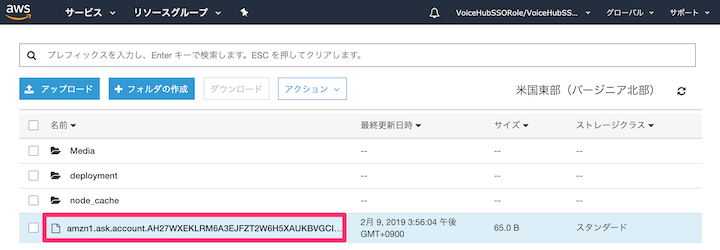

## APL対応しよう！
Duration: 7:00

### 4-1. APLファイルを作成しよう！
APLの画面レイアウトを作成するために、ファイルを新規で作成します。  
Alexa-hostedを使えば、簡単にファイルを作成することができます。

`コードエディタ`タブをクリックします。`lambda`フォルダを選択して、左上にある新規作成アイコンをクリックします。

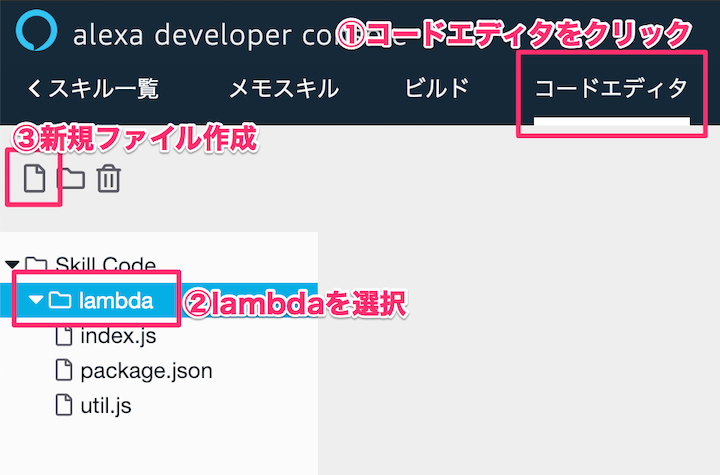

`apl_memolist.json`という名前でファイルを作成しましょう。［Create File］ボタンをクリックします。


入力する内容はこちらです。

[https://raw.githubusercontent.com/gaomar/apl_handson_190323/master/files/apl_memolist.json](https://raw.githubusercontent.com/gaomar/apl_handson_190323/master/files/apl_memolist.json)

```javascript:apl_memolist.json
{
    "type": "APL",
    "version": "1.0",
    "theme": "dark",
    "import": [
        {
            "name": "alexa-layouts",
            "version": "1.0.0"
        }
    ],
    "resources": [],
    "styles": {},
    "layouts": {
        "MemoList": {
            "parameters": [
                "listData"
            ],
            "item": {
                "type": "Container",
                "width": "100vw",
                "height": "100vh",
                "direction": "column",
                "item": {
                    "type": "Sequence",
                    "grow": 1,
                    "height": "80vh",
                    "scrollDirection": "vertical",
                    "paddingLeft": "@marginLeft",
                    "paddingRight": "@marginRight",
                    "data": "${listData}",
                    "numbered": true,
                    "items": {
                        "type": "VerticalListItem",
                        "primaryText": "${data.memo}"
                    }
                }
            }
        },
        "VerticalListItem": {
            "parameters": [
                "primaryText"
            ],
            "item": {
                "type": "Container",
                "direction": "row",
                "height": 125,
                "width": "100%",
                "alignItems": "center",
                "separator": true,
                "items": [
                    {
                        "type": "Text",
                        "text": "${ordinal}",
                        "color": "white",
                        "spacing": "5dp"
                    },
                    {
                        "type": "Text",
                        "text": "${primaryText}",
                        "color": "white",
                        "width": "100vw",
                        "spacing": "5vw"
                    }
                ]
            }
        }
    },
    "mainTemplate": {
        "parameters": [
            "payload"
        ],
        "items": [
            {
                "type": "MemoList",
                "listData": "${payload.MemoSkill.memoList}"
            }
        ]
    }
}
```

ファイルを保存し忘れないようにしましょう。

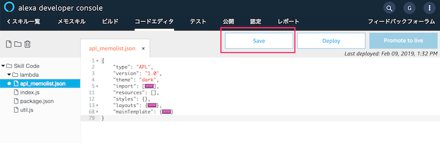

### 4-2. APLを適用しよう！
先程作成したjsonファイルをプログラムに適用します。  
index.jsファイルを書き換えます。

61行目にある`addDirective`のdocumentにjsonファイルを指定します。data部分にS3から取得したデータ値を設定します。

[https://raw.githubusercontent.com/gaomar/apl_handson_190323/master/files/step2.js](https://raw.githubusercontent.com/gaomar/apl_handson_190323/master/files/step2.js)

```javascript:index.js
const Alexa = require('ask-sdk-core');

// 1. ask persistence adapterの読み込み
const persistenceAdapter = require('ask-sdk-s3-persistence-adapter');

// 2. スキルビルダーをアダプターを使用して初期化
const skillBuilder = Alexa.SkillBuilders.custom().withPersistenceAdapter(
    new persistenceAdapter.S3PersistenceAdapter({bucketName:process.env.S3_PERSISTENCE_BUCKET})
);

// スキル起動時
const LaunchRequestHandler = {
    canHandle(handlerInput) {
        return handlerInput.requestEnvelope.request.type === 'LaunchRequest';
    },
    handle(handlerInput) {
        const speechText = 'メモを保存する場合は「メモをセーブ」。メモを聞く場合は「メモをロード」と言ってください。';
        return handlerInput.responseBuilder
            .speak(speechText)
            .reprompt(speechText)
            .getResponse();
    }
};

// メモを保存or読み取り判別
const MainIntentHandler = {
    canHandle(handlerInput) {
        return handlerInput.requestEnvelope.request.type === 'IntentRequest'
            && handlerInput.requestEnvelope.request.intent.name === 'MainIntent'
            && handlerInput.requestEnvelope.request.dialogState === 'STARTED';
    },
    async handle(handlerInput) {
        const intent = handlerInput.requestEnvelope.request.intent;
        const memoSlot = intent.slots.stat;
        var modeVal = '';
        
        if (memoSlot.value !== null) {
            if (memoSlot.resolutions["resolutionsPerAuthority"][0]["status"]["code"] === 'ER_SUCCESS_MATCH') {
                modeVal = memoSlot.resolutions["resolutionsPerAuthority"][0]["values"][0]["value"]["name"];
                
                if (modeVal === 'save') {
                    // メモする内容を聞きに行く
                    return handlerInput.responseBuilder.addDelegateDirective().getResponse();
                } else {
                    // S3から保存しているメモを取得
                    const attributesManager = handlerInput.attributesManager;
                    const s3Attributes = await attributesManager.getPersistentAttributes() || {};
                    const items = s3Attributes.hasOwnProperty('memoList')? s3Attributes.memoList : [];
                    var speechText = '';
                    var memoData = '';
                    
                    if (items.length > 0) {
                        items.forEach(function( value ) {
                             memoData += `「${value.memo}」`;
                        });
                        speechText = `保存されているメモは${items.length}つあります。${memoData}です。`;    
                    }
                    return handlerInput.responseBuilder
                        .speak(speechText)
                        .reprompt(speechText)
                        .addDirective({
                            type : 'Alexa.Presentation.APL.RenderDocument',
                            version: '1.0',
                            token: "token",
                            document: require('./apl_memolist.json'),
                            datasources: {
                                "MemoSkill": {
                                    "memoList": items
                                }
                            }
                        })            
                        .getResponse();
                }
            }
        } 
        
    }
};

// メモする言葉を取得完了
const MemoCompletedHandler = {
    canHandle(handlerInput) {
        return handlerInput.requestEnvelope.request.type === 'IntentRequest'
            && handlerInput.requestEnvelope.request.intent.name === 'MainIntent'
            && handlerInput.requestEnvelope.request.dialogState === 'IN_PROGRESS';
    },
    async handle(handlerInput) {
        const intent = handlerInput.requestEnvelope.request.intent;
        const memoVal = intent.slots.any.value;
        const speechText = `「${memoVal}」とメモしたよ`;
        const uuid = getUniqueStr();
        const attributesManager = handlerInput.attributesManager;
        const s3Attributes = await attributesManager.getPersistentAttributes() || {};
        const memoList = s3Attributes.hasOwnProperty('memoList')? s3Attributes.memoList : [];
        
        let memoData = {
            "uuid": uuid,
            "memo": memoVal
        };
        memoList.push(memoData);
        
        const sendData = {
            "memoList": memoList
        }
        attributesManager.setPersistentAttributes(sendData);
        await attributesManager.savePersistentAttributes();
    
        return handlerInput.responseBuilder
            .speak(speechText)
            .reprompt(speechText)
            .getResponse();
        
    }
};

// UUID作成
function getUniqueStr(myStrong){
    var strong = 1000;
    if (myStrong) strong = myStrong;
    return new Date().getTime().toString(16)  + Math.floor(strong*Math.random()).toString(16);
}

// ヘルプ
const HelpIntentHandler = {
    canHandle(handlerInput) {
        return handlerInput.requestEnvelope.request.type === 'IntentRequest'
            && handlerInput.requestEnvelope.request.intent.name === 'AMAZON.HelpIntent';
    },
    handle(handlerInput) {
        const speechText = 'メモを保存する場合は「メモをセーブ」。メモを聞く場合は「メモをロード」と言ってください。それではどうぞ！';

        return handlerInput.responseBuilder
            .speak(speechText)
            .reprompt(speechText)
            .getResponse();
    }
};

// キャンセルor終了と発話された
const CancelAndStopIntentHandler = {
    canHandle(handlerInput) {
        return handlerInput.requestEnvelope.request.type === 'IntentRequest'
            && (handlerInput.requestEnvelope.request.intent.name === 'AMAZON.CancelIntent'
                || handlerInput.requestEnvelope.request.intent.name === 'AMAZON.StopIntent');
    },
    handle(handlerInput) {
        const speechText = 'バイバイ！またね！';
        return handlerInput.responseBuilder
            .speak(speechText)
            .getResponse();
    }
};

// セッション切れ
const SessionEndedRequestHandler = {
    canHandle(handlerInput) {
        return handlerInput.requestEnvelope.request.type === 'SessionEndedRequest';
    },
    handle(handlerInput) {
        // Any cleanup logic goes here.
        return handlerInput.responseBuilder.getResponse();
    }
};

// エラー時
const ErrorHandler = {
    canHandle() {
        return true;
    },
    handle(handlerInput, error) {
        console.log(`~~~~ Error handled: ${error.message}`);
        const speechText = `不明なエラーが出ました`;

        return handlerInput.responseBuilder
            .speak(speechText)
            .reprompt(speechText)
            .getResponse();
    }
};

// 各種Handlerを登録する
exports.handler = skillBuilder
    .addRequestHandlers(
        LaunchRequestHandler,
        HelpIntentHandler,
        MainIntentHandler,
        MemoCompletedHandler,
        CancelAndStopIntentHandler,
        SessionEndedRequestHandler)
    .addErrorHandlers(
        ErrorHandler)
    .lambda();

```

［Save］と［Deploy］ボタンを押し忘れないようにしましょう。


### 4-3. シミュレーターで確認しよう！
APL対応できたかをシミュレーターで確認しましょう。テストタブをクリックして、スキルを起動します。

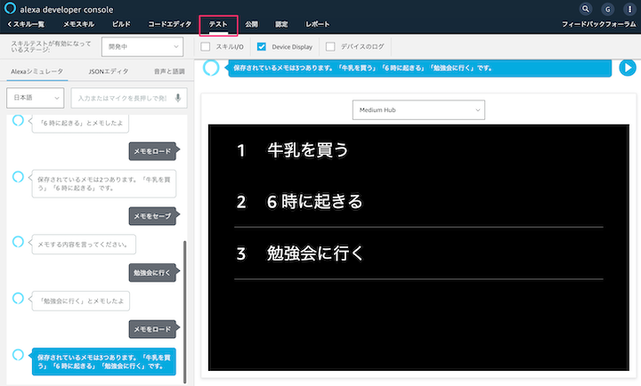

## タッチに反応させよう！
Duration: 6:00

画面タッチして反応するようにしましょう。今回はスキル初回起動時にSAVEボタンとLOADボタンを設置して、押されたボタンに応じて処理を変更します。

### 5-1. トップ画面を作る
スキル起動直後に表示するトップ画面です。  
単純にSAVEとLOADボタンが設置してあるだけです。

では、APLファイルを新規作成します。コードエディタタブをクリックして、新規ファイル作成します。

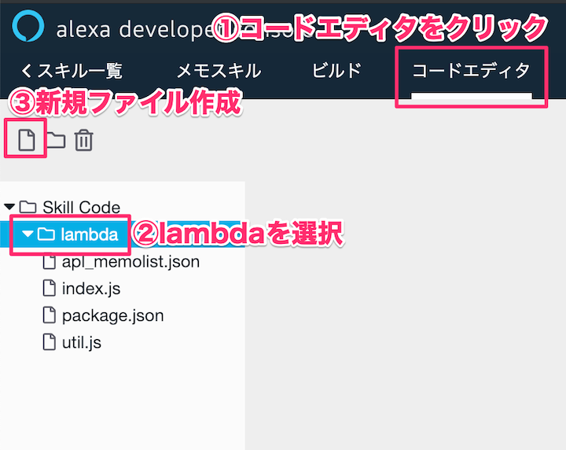

`apl_top.json`でファイルを作成します。


apl_top.jsonの中身は下記をコピペしてください。

[https://raw.githubusercontent.com/gaomar/apl_handson_190323/master/files/apl_top.json](https://raw.githubusercontent.com/gaomar/apl_handson_190323/master/files/apl_top.json)

```javascript:apl_top.json
{
    "type": "APL",
    "version": "1.0",
    "theme": "dark",
    "import": [],
    "resources": [],
    "styles": {},
    "layouts": {},
    "mainTemplate": {
        "parameters": [
            "payload"
        ],
        "items": [
            {
                "type": "Container",
                "direction": "column",
                "item": [
                    {
                        "type": "Text",
                        "textAlign": "center",
                        "paddingTop": "15vh",
                        "text": "メニュー選択"
                    },
                    {
                        "type": "Container",
                        "direction": "row",
                        "alignItems": "center",
                        "justifyContent": "center",
                        "width": "100vw",
                        "height": "50vh",
                        "paddingTop": "10vh",
                        "items": [
                            {
                                "type": "Container",
                                "paddingRight": "5vw",
                                "item": [
                                    {
                                        "type": "TouchWrapper",
                                        "onPress": {
                                            "type": "SendEvent",
                                            "arguments": [
                                                "save"
                                            ]
                                        },
                                        "item": [
                                            {
                                                "type": "Frame",
                                                "borderRadius": 10,
                                                "backgroundColor": "blue",
                                                "item": [
                                                    {
                                                        "type": "Text",
                                                        "text": "SAVE",
                                                        "width": "30vw",
                                                        "height": "20vh",
                                                        "textAlign": "center",
                                                        "textAlignVertical": "center"
                                                    }
                                                ]
                                            }
                                        ]
                                    }
                                ]
                            },
                            {
                                "type": "Container",
                                "paddingLeft": "5vw",
                                "item": [
                                    {
                                        "type": "TouchWrapper",
                                        "onPress": {
                                            "type": "SendEvent",
                                            "arguments": [
                                                "load"
                                            ]
                                        },
                                        "item": [
                                            {
                                                "type": "Frame",
                                                "borderRadius": 10,
                                                "backgroundColor": "green",
                                                "item": [
                                                    {
                                                        "type": "Text",
                                                        "text": "LOAD",
                                                        "width": "30vw",
                                                        "height": "20vh",
                                                        "textAlign": "center",
                                                        "textAlignVertical": "center"
                                                    }
                                                ]
                                            }
                                        ]
                                    }
                                ]
                            }
                        ]
                    },
                    {
                        "type": "Text",
                        "textAlign": "center",
                        "fontSize": "4vw",
                        "text": "${payload.MemoSkill.hint}"
                    }
                ]
            }
        ]
    }
}
```

APLオーサリングツールで見るとこのような画面になります。


### 5-2. 使い手にわかりやすくする
今のままだとボタン押したあとに、SAVEとLOADボタンが表示されたままになります。  
それを防ぐために画面を切り替えて、次に行ってもらう事を画面上に表示させます。

新規ファイル作成してください。


`apl_text.json`ファイルを作成します。

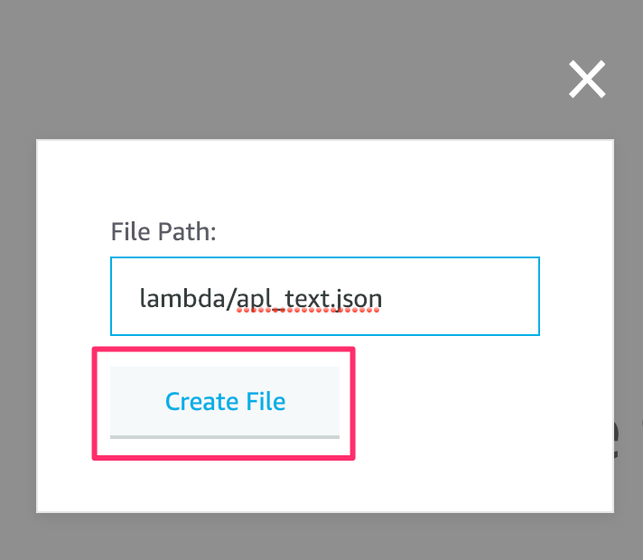

下記をコピペしてください。

[https://raw.githubusercontent.com/gaomar/apl_handson_190323/master/files/apl_text.json](https://raw.githubusercontent.com/gaomar/apl_handson_190323/master/files/apl_text.json)

```javascript:apl_text.json
{
    "type": "APL",
    "version": "1.0",
    "theme": "dark",
    "import": [],
    "resources": [],
    "styles": {},
    "layouts": {},
    "mainTemplate": {
        "parameters": [
            "payload"
        ],
        "items": [
            {
                "type": "Container",
                "width": "100vw",
                "height": "100vh",
                "alignItems": "center",
                "direction": "column",
                "justifyContent": "center",
                "item": [
                    {
                        "type": "Text",
                        "width": "90vw",
                        "textAlign": "center",
                        "fontSize": "10vw",
                        "text": "${payload.MemoSkill.word}"
                    }
                ]
            }
        ]
    }
}
```

APLオーサリングツールで見るとこのような画面になります。  
`${payload.MemoSkill.word}`部分はプログラムで可変できるようにしています。


### 5-3. APLを適用する
今まで作成したAPLを適用します。step3.jsの中身をコピペしてください。

[https://raw.githubusercontent.com/gaomar/apl_handson_190323/master/files/step3.js](https://raw.githubusercontent.com/gaomar/apl_handson_190323/master/files/step3.js)

```javascript:index.js
const Alexa = require('ask-sdk-core');

// 1. ask persistence adapterの読み込み
const persistenceAdapter = require('ask-sdk-s3-persistence-adapter');

// 2. スキルビルダーをアダプターを使用して初期化
const skillBuilder = Alexa.SkillBuilders.custom().withPersistenceAdapter(
    new persistenceAdapter.S3PersistenceAdapter({bucketName:process.env.S3_PERSISTENCE_BUCKET})
);

// スキル起動時
const LaunchRequestHandler = {
    canHandle(handlerInput) {
        return handlerInput.requestEnvelope.request.type === 'LaunchRequest';
    },
    handle(handlerInput) {
        const speechText = 'メニューをタップしてください。';
        return handlerInput.responseBuilder
            .speak(speechText)
            .addDirective({
                type : 'Alexa.Presentation.APL.RenderDocument',
                version: '1.0',
                token: "token",
                document: require('./apl_top.json'),
                datasources: {
                    "MemoSkill": {
                        "hint": "メニューをタップしてください"
                    }
                }
            })            
            .getResponse();
    }
};

// 画面タッチ処理
// シミュレーターではonPressが反応し、実機ではPressが反応するため2つ書いておく
const TouchEventHandler = {
    canHandle(handlerInput) {
    return ((handlerInput.requestEnvelope.request.type === 'Alexa.Presentation.APL.UserEvent' &&
        (handlerInput.requestEnvelope.request.source.handler === 'Press' || 
        handlerInput.requestEnvelope.request.source.handler === 'onPress')));
    },
    async handle(handlerInput) {
        // TcouhWrapperのargumentsで指定したパラメータを取得する
        const choice = handlerInput.requestEnvelope.request.arguments[0];

        if (choice === 'save') {
            return handlerInput.responseBuilder
                .speak('メモする言葉を言ってください。')
                .addDirective({
                    type : 'Alexa.Presentation.APL.RenderDocument',
                    version: '1.0',
                    token: "token",
                    document: require('./apl_text.json'),
                    datasources: {
                        "MemoSkill": {
                            "word": "「アレクサ、○○とメモして」と言ってください。" 
                        }
                    }
                })            
                .getResponse();

            
        }
            
        // S3から保存しているメモを取得
        const attributesManager = handlerInput.attributesManager;
        const s3Attributes = await attributesManager.getPersistentAttributes() || {};
        const items = s3Attributes.hasOwnProperty('memoList')? s3Attributes.memoList : [];
        var speechText = '';
        var memoData = '';
        
        if (items.length > 0) {
            items.forEach(function( value ) {
                 memoData += `「${value.memo}」`;
            });
            speechText = `保存されているメモは${items.length}つあります。${memoData}です。`;    
        }
        return handlerInput.responseBuilder
            .speak(speechText)
            .reprompt(speechText)
            .addDirective({
                type : 'Alexa.Presentation.APL.RenderDocument',
                version: '1.0',
                token: "token",
                document: require('./apl_memolist.json'),
                datasources: {
                    "MemoSkill": {
                        "memoList": items
                    }
                }
            })            
            .getResponse();
    }
};

// メモを保存or読み取り判別
const MainIntentHandler = {
    canHandle(handlerInput) {
        return handlerInput.requestEnvelope.request.type === 'IntentRequest'
            && handlerInput.requestEnvelope.request.intent.name === 'MainIntent'
            && handlerInput.requestEnvelope.request.dialogState === 'STARTED';
    },
    async handle(handlerInput) {
        const intent = handlerInput.requestEnvelope.request.intent;
        const memoSlot = intent.slots.stat;
        var modeVal = '';
        
        if (memoSlot.value !== null) {
            if (memoSlot.resolutions["resolutionsPerAuthority"][0]["status"]["code"] === 'ER_SUCCESS_MATCH') {
                modeVal = memoSlot.resolutions["resolutionsPerAuthority"][0]["values"][0]["value"]["name"];
                
                if (modeVal === 'save') {
                    // メモする内容を聞きに行く
                    return handlerInput.responseBuilder.addDelegateDirective().getResponse();
                } else {
                    // S3から保存しているメモを取得
                    const attributesManager = handlerInput.attributesManager;
                    const s3Attributes = await attributesManager.getPersistentAttributes() || {};
                    const items = s3Attributes.hasOwnProperty('memoList')? s3Attributes.memoList : [];
                    var speechText = '';
                    var memoData = '';
                    
                    if (items.length > 0) {
                        items.forEach(function( value ) {
                             memoData += `「${value.memo}」`;
                        });
                        speechText = `保存されているメモは${items.length}つあります。${memoData}です。`;    
                    }
                    return handlerInput.responseBuilder
                        .speak(speechText)
                        .reprompt(speechText)
                        .addDirective({
                            type : 'Alexa.Presentation.APL.RenderDocument',
                            version: '1.0',
                            token: "token",
                            document: require('./apl_memolist.json'),
                            datasources: {
                                "MemoSkill": {
                                    "memoList": items
                                }
                            }
                        })            
                        .getResponse();
                }
            }
        } 
        
    }
};

// メモする言葉を取得完了
const MemoCompletedHandler = {
    canHandle(handlerInput) {
        return (handlerInput.requestEnvelope.request.type === 'IntentRequest'
            && handlerInput.requestEnvelope.request.intent.name === 'MainIntent'
            && handlerInput.requestEnvelope.request.dialogState === 'IN_PROGRESS') ||
            (handlerInput.requestEnvelope.request.type === 'IntentRequest'
            && handlerInput.requestEnvelope.request.intent.name === 'SaveIntent');
    },
    async handle(handlerInput) {
        const intent = handlerInput.requestEnvelope.request.intent;
        const memoVal = intent.slots.any.value;
        const speechText = `「${memoVal}」とメモしたよ`;
        const uuid = getUniqueStr();
        const attributesManager = handlerInput.attributesManager;
        const s3Attributes = await attributesManager.getPersistentAttributes() || {};
        const memoList = s3Attributes.hasOwnProperty('memoList')? s3Attributes.memoList : [];
        
        let memoData = {
            "uuid": uuid,
            "memo": memoVal
        };
        memoList.push(memoData);
        
        const sendData = {
            "memoList": memoList
        }
        attributesManager.setPersistentAttributes(sendData);
        await attributesManager.savePersistentAttributes();
    
        return handlerInput.responseBuilder
            .speak(speechText)
            .addDirective({
                type : 'Alexa.Presentation.APL.RenderDocument',
                version: '1.0',
                token: "token",
                document: require('./apl_top.json'),
                datasources: {
                    "MemoSkill": {
                        "hint": speechText
                    }
                }
            })            
            .getResponse();
        
    }
};

// UUID作成
function getUniqueStr(myStrong){
    var strong = 1000;
    if (myStrong) strong = myStrong;
    return new Date().getTime().toString(16)  + Math.floor(strong*Math.random()).toString(16);
}

// ヘルプ
const HelpIntentHandler = {
    canHandle(handlerInput) {
        return handlerInput.requestEnvelope.request.type === 'IntentRequest'
            && handlerInput.requestEnvelope.request.intent.name === 'AMAZON.HelpIntent';
    },
    handle(handlerInput) {
        const speechText = 'メモを保存する場合は「メモをセーブ」。メモを聞く場合は「メモをロード」と言ってください。それではどうぞ！';

        return handlerInput.responseBuilder
            .speak(speechText)
            .reprompt(speechText)
            .getResponse();
    }
};

// キャンセルor終了と発話された
const CancelAndStopIntentHandler = {
    canHandle(handlerInput) {
        return handlerInput.requestEnvelope.request.type === 'IntentRequest'
            && (handlerInput.requestEnvelope.request.intent.name === 'AMAZON.CancelIntent'
                || handlerInput.requestEnvelope.request.intent.name === 'AMAZON.StopIntent');
    },
    handle(handlerInput) {
        const speechText = 'バイバイ！またね！';
        return handlerInput.responseBuilder
            .speak(speechText)
            .getResponse();
    }
};

// セッション切れ
const SessionEndedRequestHandler = {
    canHandle(handlerInput) {
        return handlerInput.requestEnvelope.request.type === 'SessionEndedRequest';
    },
    handle(handlerInput) {
        // Any cleanup logic goes here.
        return handlerInput.responseBuilder.getResponse();
    }
};

// エラー時
const ErrorHandler = {
    canHandle() {
        return true;
    },
    handle(handlerInput, error) {
        console.log(`~~~~ Error handled: ${error.message}`);
        const speechText = `不明なエラーが出ました`;

        return handlerInput.responseBuilder
            .speak(speechText)
            .reprompt(speechText)
            .getResponse();
    }
};

// 各種Handlerを登録する
exports.handler = skillBuilder
    .addRequestHandlers(
        LaunchRequestHandler,
        HelpIntentHandler,
        MainIntentHandler,
        MemoCompletedHandler,
        TouchEventHandler,
        CancelAndStopIntentHandler,
        SessionEndedRequestHandler)
    .addErrorHandlers(
        ErrorHandler)
    .lambda();

```

### 5-4. メモ保存用Intentを作成する
APLからDialogモードを制御することができません。  
専用のIntentを作成して、そのIntentを経由して実現します。

ビルドタブをクリックして、インテント側にある［追加］ボタンをクリックします。


自由テキストを手に入れるために変数名`any`を指定して、`AMAZON.SearchQuery`を選択します。  
サンプル発話に3種類ほど登録してから、［保存］［ビルド］を実行します。


### 5-5. シミュレーターで確認する
テストタブをクリックして、シミュレーター画面に遷移してください。  
スキルを起動するとSAVEとLOADボタンが表示されるので、SAVEボタンをクリックして動作確認してみましょう。

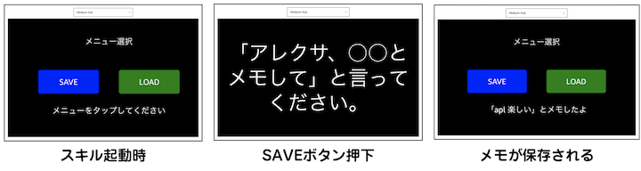

## 元号ジェネレーターを作ってみよう
Duration: 10:00

余力がある方は既にAlexaストアで公開している元号ジェネレーターを作ってみましょう。
このスキルは今までに使われた元号の漢字からランダムで2文字生成して背景画像と合成します。

[https://www.amazon.co.jp/gp/product/B07PF7PQXT](https://www.amazon.co.jp/gp/product/B07PF7PQXT)

### 6-1. 新規スキルを作成
新しいスキルを作成するので、［スキルの作成］ボタンをクリックします。


スキル名に「元号ツール」モデルは`カスタム`、ホスティング方法を`Alexaがホスト`をそれぞれ選択して、右上の［スキルを作成］ボタンをクリックします。


画面が切り替わったら、左メニューにある`インターフェース`をクリックします。
`Displayインターフェース`と`APL`をそれぞれ有効にします。
有効にしたら、ビルドと保存ボタンをクリックします。


### 6-2. コードを編集する
`コードエディタ`タブをクリックします。`index.js`をクリックしてコードを編集します。
下記URLからコードをコピペしてください。

[https://raw.githubusercontent.com/gaomar/apl_handson_190323/master/files/step4.js](https://raw.githubusercontent.com/gaomar/apl_handson_190323/master/files/step4.js)


### 6-3. APLファイルを新規作成
`lambda`フォルダを選択して左上にある新規ファイル作成ボタンをクリックします。


ファイル名は`apl_gengo.json`としてください。


apl_gengo.jsonファイルを編集します。下記URLからコードをコピペしてください。

[https://raw.githubusercontent.com/gaomar/apl_handson_190323/master/files/apl_gengo.json](https://raw.githubusercontent.com/gaomar/apl_handson_190323/master/files/apl_gengo.json)

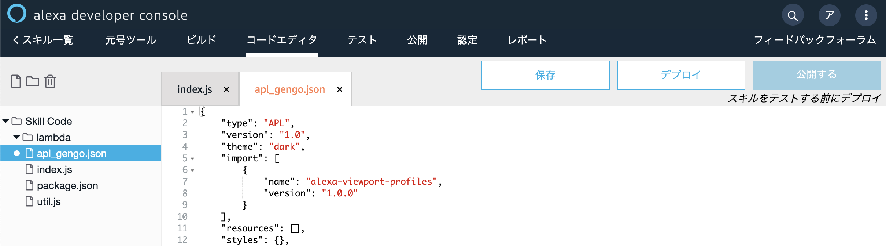

### 6-4. シミュレーターで確認する
テストタブをクリックしてシミュレーターでテストしてみましょう。
プルダウンメニューから`開発中`を選択します。

「元号ツールをひらいて」と入力するとスキルを実行することができます。


### 6-5. Alexa-hostedのS3から画像を呼ぶ
Alexa-hostedにはS3も使えます。
コードエディタの左下にS3のリンクがあるのでクリックします。


こちらの`gengo.png`画像を一度ローカルPCにダウンロードします。

[https://github.com/gaomar/apl_handson_190323/raw/master/files/gengo.png](https://github.com/gaomar/apl_handson_190323/raw/master/files/gengo.png)

S3のページが表示されたら、画像をアップロードするので［アップロード］ボタンを押します。


先程ダウンロードした`gengo.png`ファイルを指定して。アップロードボタンをクリックします。


Alexa Developer Consoleに戻って、`apl_gengo.json`ファイルを編集します。
32行目を下記に書き換えます。保存ボタンを忘れずにクリックします。

```
"source": "${payload.skilldata.backgroundUrl}",
```


続いて`index.js`ファイルも書き換えます。
step5.jsの内容をコピペします。保存とデプロイを忘れずにしましょう！

[https://raw.githubusercontent.com/gaomar/apl_handson_190323/master/files/step5.js](https://raw.githubusercontent.com/gaomar/apl_handson_190323/master/files/step5.js)

2行目でutil.jsファイルを指定してS3から取得する関数を呼び出します。
27行目でS3に保存されているファイル名を指定して、一時アクセス可能なURLを取得します。
56行目でAPLに画像URLを指定します。


### 6-6. シミュレーターで確認
これでスキルをテストするとS3から画像を呼び出していることが確認できると思います。

### 6-7. まとめ
APLを使えば簡単に画面対応することができます。アイデア次第で様々なスキルを開発することができるので、どんどんAPLを使っていきましょう！
